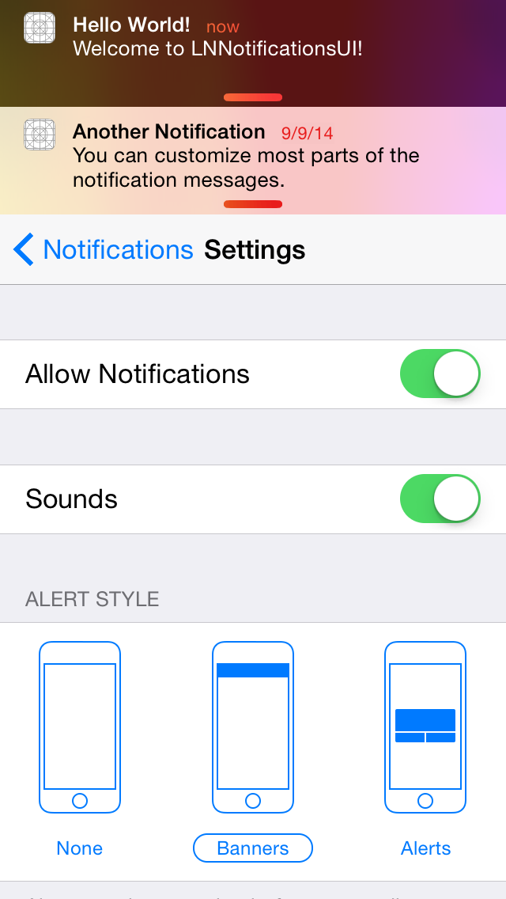
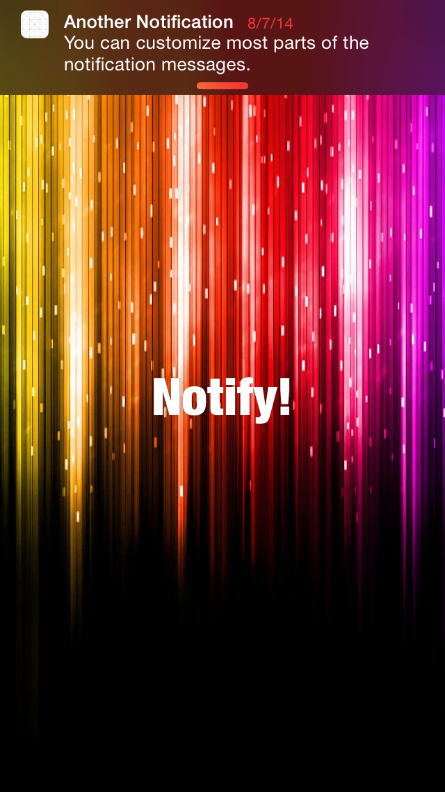
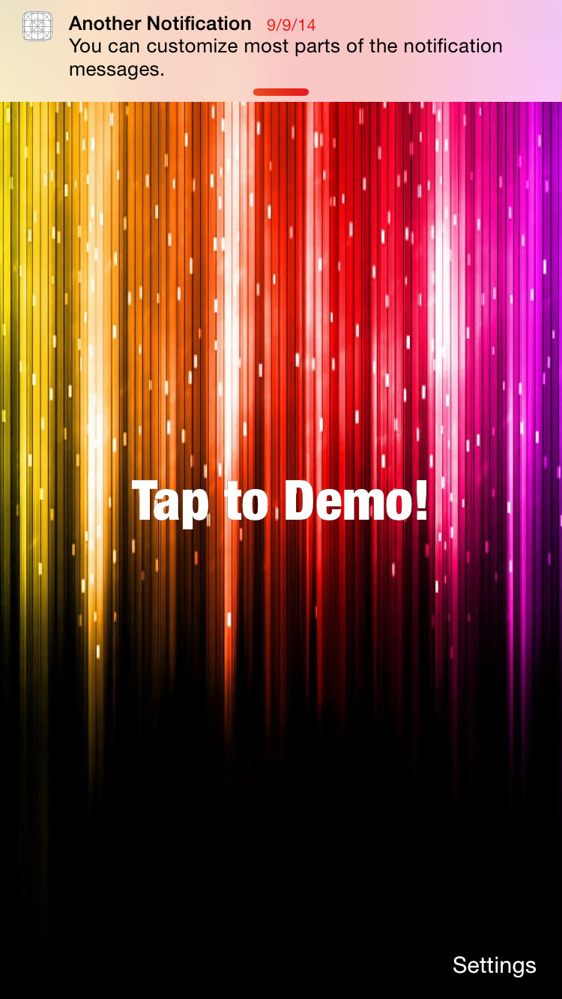
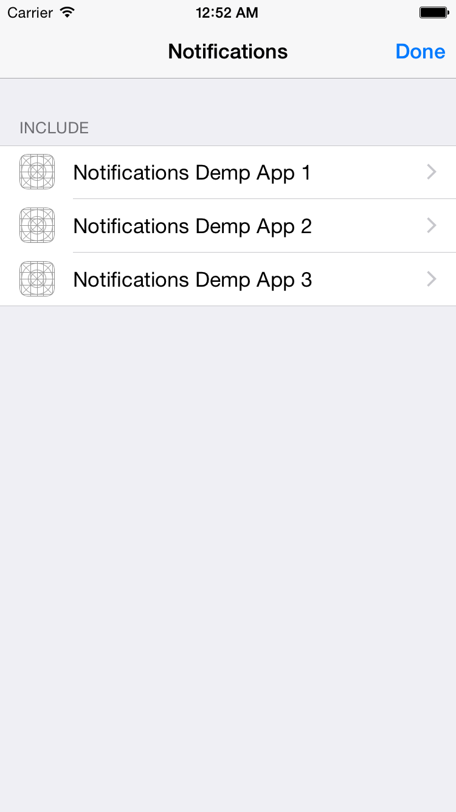
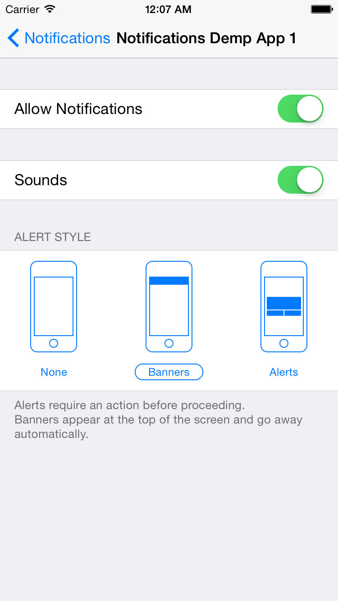

# **Deprecation Notice**

This framework is **no longer under active devlopment**. With iOS 10, you can now **display native system notifications inside your app**. I suggest migrating to Apple's new API going forward. This framework remains useful for iOS 8 & 9 support. New features will likely not be implemented, but bugs may be fixed.

----

# LNNotificationsUI

`LNNotificationsUI` is a framework for displaying notifications similar to Apple's iOS 8 and iOS 9 notifications. It is meant to complement the native look and feel, by providing a pixel-accurate (as much as possible) recreation of the notifications.

 


See a video [here](https://vimeo.com/105395794).

<span class="badge-paypal"><a href="https://www.paypal.com/cgi-bin/webscr?cmd=_s-xclick&hosted_button_id=BR68NJEJXGWL6" title="Donate to this project using PayPal"></a></span>

## Features

* Native look & feel
* Support for notifications of multiple sub-applications
* Customizable notifications
* Different banner styles:

&nbsp;


* Settings for registered sub-applications:

&nbsp;


* Sounds support
* Xcode 6 framework

## Adding to Your Project

###Carthage

Add the following to your Cartfile:

```github "LeoNatan/LNNotificationsUI"```

###Manual

Drag the `LNNotificationsUI.xcodeproj` project to your project, and add `LNNotificationsUI.framework` to **Embedded Binaries** in your project target's **General** tab. Xcode should sort everything else on its own.

###CocoaPods

CocoaPods is not supported. There are many reasons for this. Instead of CocoaPods, use Carthage. You can continue using CocoaPods for for your other dependencies and Carthage for `LNNotificationsUI`.

## Using the Framework

###Project Integration

First import the umbrella header file:

```objective-c
@import LNNotificationsUI;
```

###Registering Sub-applications

Before being able to post notifications, you need to register at least one sub-application with the system. Sub-applications provide a way to group notifications, each with its own identifier, name and icon and other settings. For example, a productivity app with an e-mail client and a calendar may register two sub-applications, "Mail" and "Calendar", with different icons and other more advanced settings, such calendar notifications appearing as alerts by default.

```objective-c
[[LNNotificationCenter defaultCenter] registerApplicationWithIdentifier:@"mail_app_identifier" name:@"Mail" icon:[UIImage imageNamed:@"MailApp"] defaultSettings:[LNNotificationAppSettings defaultNotificationAppSettings]];
[[LNNotificationCenter defaultCenter] registerApplicationWithIdentifier:@"cal_app_identifier" name:@"Calendar" icon:[UIImage imageNamed:@"CalApp"]  defaultSettings:[LNNotificationAppSettings defaultNotificationAppSettings]];
```

**Note:** For all available options for the default settings, take a look at the `LNNotificationAppSettings` class definition. `+ [LNNotificationAppSettings defaultNotificationAppSettings]` is provided as a convenience for obtaining the default settings.

###Displaying Notifications

Create a notification object, set the desired parameters and post it.

```objective-c
LNNotification* notification = [LNNotification notificationWithMessage:@"You've Got Mail!"];
[[LNNotificationCenter defaultCenter] presentNotification:notification forApplicationIdentifier:@"mail_app_identifier"];
```

**Note:** For all available notification properties, take a look at the `LNNotification` class definition.

###Notification Actions

In addition to displaying notifications, you can associate actions with each notification. Each notification has a default action, as well as other actions that can be attached to the notification. When the user taps a notification or the appropriate button, the provided handler block is called.

```objective-c
LNNotification* notification = [LNNotification notificationWithMessage:@"Welcome to LNNotificationsUI!"];
notification.title = @"Hello World!";
notification.soundName = @"demo.aiff";
notification.defaultAction = [LNNotificationAction actionWithTitle:@"Default Action" handler:^(LNNotificationAction *action) {
	//Handle default action
}];
notification.otherActions = @[[LNNotificationAction actionWithTitle:@"Other Action 1" handler:^(LNNotificationAction *action) {
	//Handle other action here
}], [LNNotificationAction actionWithTitle:@"Other Action 2" handler:^(LNNotificationAction *action) {
	//Handle other action here
}]];
```
**Note:** Currently, other actions are only available when notifications are presented as alerts. Tapping on banner notifications will call the default action handler.

###Settings

To display the notification settings view controller, create an instance of `LNNotificationSettingsController`, either in code or storyboard and present it. This view controller will display all registered sub-applications, and will allow the user to select how notifications are presented to him. If only one sub-application is registered, its settings will appear in this view controller. If there two or more sub-applications registered, a list containing each sub-application will appear and and the user will be able to select modify settings seperately for each sub-application.
